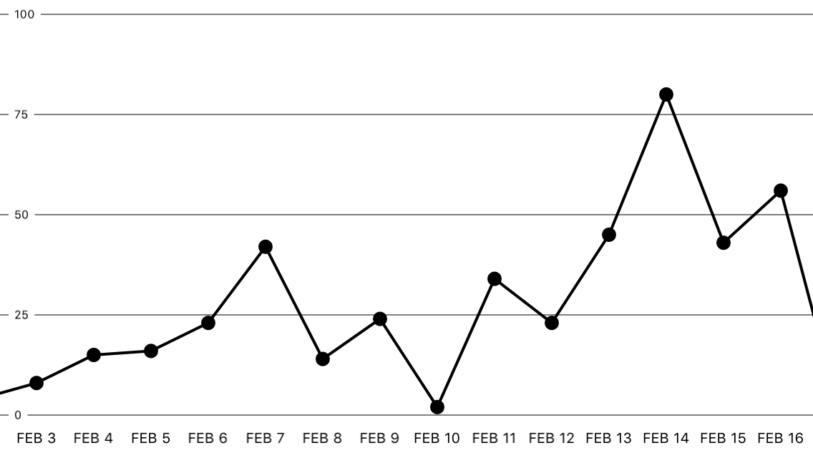
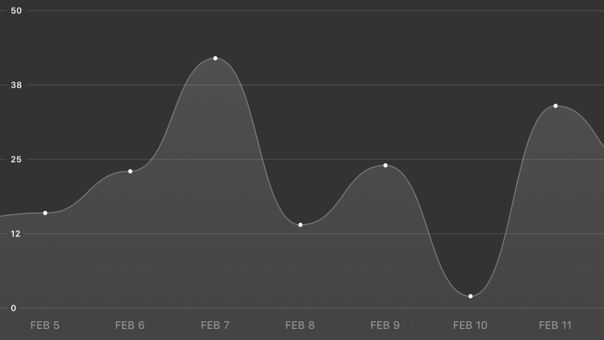
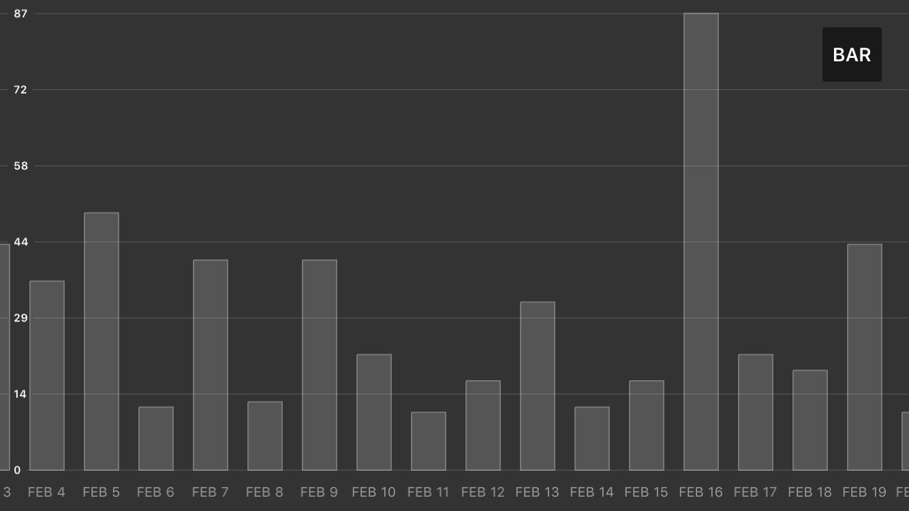
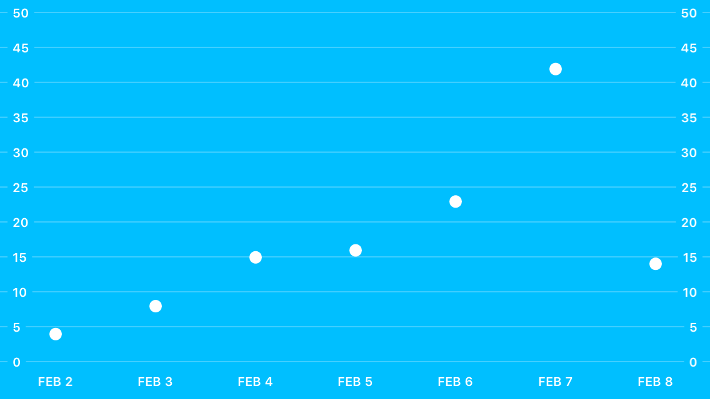
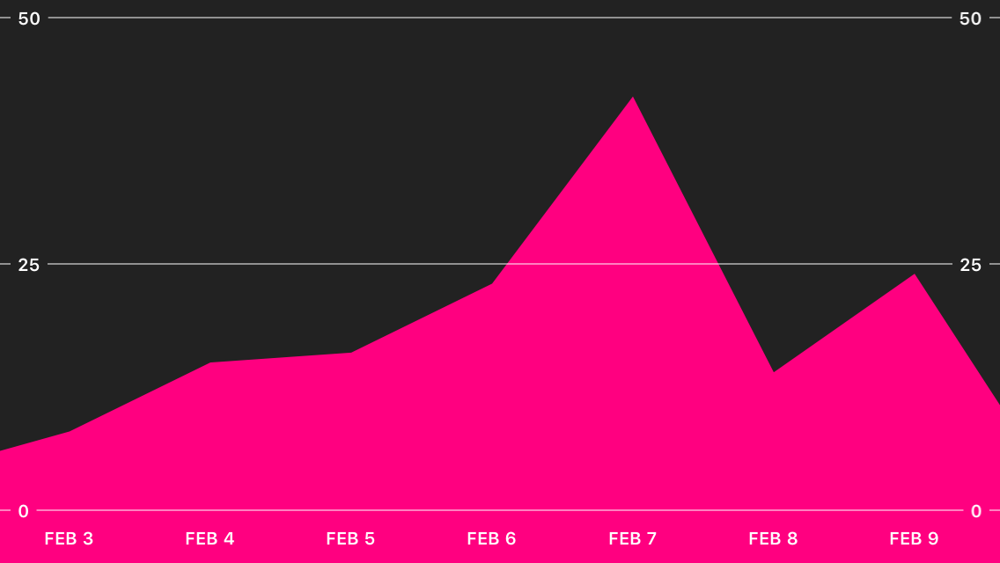
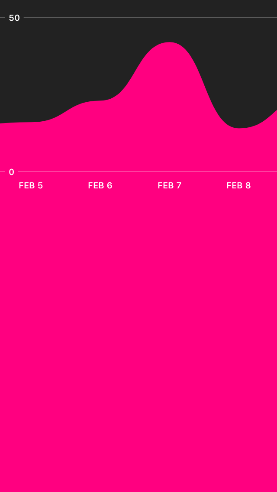

# ScrollableGraphView

## About


An adaptive scrollable graph view for iOS to visualise simple discrete datasets. Written in Swift. Originally written for a small personal project.

The main goal of the this graph component is to visualise simple discrete datasets and allow the the user to scroll through the graph.


## Contents

- [Features](#features)
- [Basic Usage](#usage)
- [Customisation](#customisation)
- [Customisation Examples](#customisation-examples)
- [Improvements](#improvements)
- [Known Issues](#known-issues)
- [Other](#other)

## Features

| Feature List |
|--------|
| Initialisation animations and range adaption animations. <br><br> |
| Range adaption when scrolling through the graph. The range of the y-axis will automatically adapt to to the min and max of the visible points. <br><br> |
| Smooth scrolling around the graph. <br><br> |
| Handles a relatively large number of points without lagging. <br><br> |
| Many customisation options. (Check the customisation section) <br><br> |


## Usage

### Adding the ScrollableGraphView to your project:

Add the ```ScrollableGraphView``` class to your project. There are two ways to add the ScrollableGraphView to your project.

#### Manually
Add [ScrollableGraphView.swift](Classes/ScrollableGraphView.swift) to your project in Xcode  

#### CocoaPods
Add ```pod 'ScrollableGraphView'``` to your Podfile and then make sure to ```import ScrollableGraphView``` in your code.

### Creating a graph and setting the data.

1. Create a ScrollableGraphView instance and set the data and labels  
    ```swift
    let graphView = ScrollableGraphView(frame: someFrame)
    let data: [Double] = [4, 8, 15, 16, 23, 42]
    let labels = ["one", "two", "three", "four", "five", "six"]
    graphView.setData(data, withLabels: labels)
    ```  

2. Add the ScrollableGraphView to the view hierarchy.
    ```swift
    someViewController.view.addSubview(graphView)
    ```

### Things you *could* use it for:

- ✔ Study applications to show time studied/etc
- ✔ Weather applications
- ✔ Prototyping
- ✔ *Simple* data visualisation

### Things you **shouldn't/cannot** use it for:

- ✘ Rigorous statistical software
- ✘ Important & complex data visualisation
- ✘ Graphing continuous mathematical functions

## Customisation

The graph can be customised by setting any of the following public properties before displaying the ScrollableGraphView. The defaults are shown below.

### Line Styles

| Property  | Description                                                                                                                                                                        |
|-----------|------------------------------------------------------------------------------------------------------------------------------------------------------------------------------------|
| **lineWidth**: CGFloat | Specifies how thick the graph of the line is. In points.                                                                                                                           |
| **lineColor**: UIColor | The color of the graph line. UIColor.                                                                                                                                              |
| **lineStyle**: ScrollableGraphViewLineStyle | Whether or not the line should be rendered using bezier curves are straight lines. Possible values: <ul><li>`ScrollableGraphViewLineStyle.Straight`</li><li>`ScrollableGraphViewLineStyle.Smooth`</li></ul> |
| **lineJoin**  | How each segment in the line should connect. Takes any of the Core Animation LineJoin values.                                                                                      |
| **lineCap**   | The line caps. Takes any of the Core Animation LineCap values.                                                                                                                     |

### Fill Styles
| Property               | Description                                                                                                                                                                                                         |
|------------------------|---------------------------------------------------------------------------------------------------------------------------------------------------------------------------------------------------------------------|
| **backgroundFillColor**: UIColor    | The background colour for the entire graph view, not just the plotted graph.                                                                                                                                        |
| **shouldFill**: Bool             | Specifies whether or not the plotted graph should be filled with a colour or gradient.                                                                                                                              |
| **fillType**: ScrollableGraphViewFillType               | Specifies whether to fill the graph with a solid colour or gradient. Possible values: <ul><li>`ScrollableGraphViewFillType.Solid`</li> <li>`ScrollableGraphViewFillType.Gradient`</li></ul>                                                         |
| **fillColor**: UIColor              | If `fillType` is set to `.Solid` then this colour will be used to fill the graph.                                                                                                                                       |
| **fillGradientStartColor**: UIColor | If `fillType` is set to `.Gradient` then this will be the starting colour for the gradient.                                                                                                                             |
| **fillGradientEndColor**: UIColor   | If `fillType` is set to `.Gradient`, then this will be the ending colour for the gradient.                                                                                                                              |
| **fillGradientType**:ScrollableGraphViewGradientType       | If `fillType` is set to `.Gradient`, then this defines whether the gradient is rendered as a linear gradient or radial gradient. Possible values: <ul><li>`ScrollableGraphViewFillType.Solid`</li><li>`ScrollableGraphViewFillType.Gradient`</li></ul> |

### Bar Styles

| Property                 | Description                                                                                                                                                                                                                                                           |
|--------------------------|-----------------------------------------------------------------------------------------------------------------------------------------------------------------------------------------------------------------------------------------------------------------------|
| **shouldDrawBarLayer**: Bool | Whether bars should be drawn or not. If you want a bar graph, this should be set to `true`. However, you will probably want to disable drawing the data points with `shouldDrawDataPoint = false`. If you want to hide the line as well: `lineColor = UIColor.clearColor()` |
| **barWidth**: CGFloat        | The width of an individual bar on the graph.                                                                                                                                                                                                                          |
| **barColor**: UIColor        | The actual colour of the bar.                                                                                                                                                                                                                                         |
| **barLineWidth**: CGFloat    | The width of the outline of the bar                                                                                                                                                                                                                                   |
| **barLineColor**: UIColor    | The colour of the bar outline                                                                                                                                                                                                                                         |

### Spacing


| Property              | Description                                                                                                                                                                                                                                                                                                |
|-----------------------|------------------------------------------------------------------------------------------------------------------------------------------------------------------------------------------------------------------------------------------------------------------------------------------------------------|
| **topMargin**: CGFloat             | How far the "maximum" reference line is from the top of the view's frame. In points.                                                                                                                                                                                                                       |
| **bottomMargin**: CGFloat          | How far the "minimum" reference line is from the bottom of the view's frame. In points.                                                                                                                                                                                                                    |
| **leftmostPointPadding**: CGFloat  | How far the first point on the graph should be placed from the left hand side of the view.                                                                                                                                                                                                                 |
| **rightmostPointPadding**: CGFloat | How far the final point on the graph should be placed from the right hand side of the view.                                                                                                                                                                                                                |
| **dataPointSpacing**: CGFloat      | How much space should be between each data point.                                                                                                                                                                                                                                                          |
| **direction**: ScrollableGraphViewDirection             | Which way the user is expected to scroll from. Possible values: <ul><li>`ScrollableGraphViewDirection.LeftToRight`</li><li>`ScrollableGraphViewDirection.RightToLeft`</li></ul>For example, if it is set to `.RightToLeft`, the graph will start on the "right hand side" of the graph and the user will have to scroll towards the left. |


### Graph Range

| Property                       | Description                                                                                                                                                                                                |
|--------------------------------|------------------------------------------------------------------------------------------------------------------------------------------------------------------------------------------------------------|
| **rangeMin**: Double                       | The minimum value for the y-axis. This is ignored when `shouldAutomaticallyDetectRange` or `shouldAdaptRange` = `true`                                                                                           |
| **rangeMax**: Double                       | The maximum value for the y-axis. This is ignored when `shouldAutomaticallyDetectRange` or `shouldAdaptRange` = `true`                                                                                           |
| **shouldAutomaticallyDetectRange**: Bool | If this is set to `true`, then the range will automatically be detected from the data the graph is given.                                                                                                    |
| **shouldRangeAlwaysStartAtZero**: Bool   | Forces the graph's minimum to always be zero. Used in conjunction with `shouldAutomaticallyDetectRange` or `shouldAdaptRange`, if you want to force the minimum to stay at 0 rather than the detected minimum. |


### Data Point Drawing

| Property                                                  | Description                                                                                                                                                                                                                                                                 |
|-----------------------------------------------------------|-----------------------------------------------------------------------------------------------------------------------------------------------------------------------------------------------------------------------------------------------------------------------------|
| **shouldDrawDataPoint**: Bool                                 | Whether or not to draw a symbol for each data point.                                                                                                                                                                                                                        |
| **dataPointType**: ScrollableGraphViewDataPointType           | The shape to draw for each data point. Possible values: <ul><li>`ScrollableGraphViewDataPointType.Circle`</li><li>`ScrollableGraphViewDataPointType.Square`</li><li>`ScrollableGraphViewDataPointType.Custom`</li></ul>                                                                                               |
| **dataPointSize**: CGFloat                                    | The size of the shape to draw for each data point.                                                                                                                                                                                                                          |
| **dataPointFillColor**: UIColor                               | The colour with which to fill the shape.                                                                                                                                                                                                                                    |
| **customDataPointPath**: ((centre: CGPoint) -> UIBezierPath)? | If `dataPointType` is set to `.Custom` then you,can provide a closure to create any kind of shape you would like to be displayed instead of just a circle or square. The closure takes a `CGPoint` which is the centre of the shape and it should return a complete `UIBezierPath`. |

### Adapting & Animations

| Property                                                | Description                                                                                                                                                                                                                                                                                            |
|---------------------------------------------------------|--------------------------------------------------------------------------------------------------------------------------------------------------------------------------------------------------------------------------------------------------------------------------------------------------------|
| **shouldAdaptRange**: Bool                                  | Whether or not the y-axis' range should adapt to the points that are visible on screen. This means if there are only 5 points visible on screen at any given time, the maximum on the y-axis will be the maximum of those 5 points. This is updated automatically as the user scrolls along the graph. |
| **shouldAnimateOnAdapt**: Bool                              | If `shouldAdaptRange` is set to true then this specifies whether or not the points on the graph should animate to their new positions. Default is set to `true`. Looks very janky if set to `false`.                                                                                                         |
| **animationDuration**: Double                               | How long the animation should take. Affects both the startup animation and the animation when the range of the y-axis adapts to onscreen points.                                                                                                                                                       |
| **adaptAnimationType**: ScrollableGraphViewAnimationType    | The animation style. Possible values: <ul><li>`ScrollableGraphViewAnimationType.EaseOut`</li><li>`ScrollableGraphViewAnimationType.Elastic`</li><li>`ScrollableGraphViewAnimationType.Custom`</li></ul>                                                                                                                                          |
| **customAnimationEasingFunction**: ((t: Double) -> Double)? | If `adaptAnimationType` is set to `.Custom`, then this is the easing function you would like applied for the animation.                                                                                                                                                                                    |
| **shouldAnimateOnStartup**: Bool                            | Whether or not the graph should animate to their positions when the graph is first displayed.                                                                                                                                                                                                          |

### Reference Lines

| Property                                                        | Description                                                                                                                                                                                                                                                                                                                                                                                                                                                                  |
|-----------------------------------------------------------------|------------------------------------------------------------------------------------------------------------------------------------------------------------------------------------------------------------------------------------------------------------------------------------------------------------------------------------------------------------------------------------------------------------------------------------------------------------------------------|
| **shouldShowReferenceLines**: Bool                                  | Whether or not to show the y-axis reference lines and labels.                                                                                                                                                                                                                                                                                                                                                                                                                |
| **referenceLineColor**: UIColor                                     | The colour for the reference lines.                                                                                                                                                                                                                                                                                                                                                                                                                                          |
| **referenceLineThickness**: CGFloat                                 | The thickness of the reference lines.                                                                                                                                                                                                                                                                                                                                                                                                                                        |
| **referenceLinePosition**: ScrollableGraphViewReferenceLinePosition | Where the labels should be displayed on the reference lines. Possible values: <ul><li>`ScrollableGraphViewReferenceLinePosition.Left`</li><li>`ScrollableGraphViewReferenceLinePosition.Right`</li><li>`ScrollableGraphViewReferenceLinePosition.Both`</li></ul>                                                                                                                                                                                                                                                       |
| **referenceLineType**: ScrollableGraphViewReferenceLineType         | The type of reference lines. Currently only `.Cover` is available.                                                                                                                                                                                                                                                                                                                                                                                                             |
| **numberOfIntermediateReferenceLines**: Int                         | How many reference lines should be between the minimum and maximum reference lines. If you want a total of 4 reference lines, you would set this to 2. This can be set to 0 for no intermediate reference lines.This can be used to create reference lines at specific intervals. If the desired result is to have a reference line at every 10 units on the y-axis, you could, for example, set `rangeMax` to 100, rangeMin to 0 and `numberOfIntermediateReferenceLines` to 9. |
| **shouldAddLabelsToIntermediateReferenceLines**: Bool               | Whether or not to add labels to the intermediate reference lines.                                                                                                                                                                                                                                                                                                                                                                                                            |
| **shouldAddUnitsToIntermediateReferenceLineLabels**: Bool           | Whether or not to add units specified by the `referenceLineUnits` variable to the labels on the intermediate reference lines.                                                                                                                                                                                                                                                                                                                                                  |

### Reference Line Labels

| Property                                | Description                                                                             |
|-----------------------------------------|-----------------------------------------------------------------------------------------|
| **referenceLineLabelFont**: UIFont          | The font to be used for the reference line labels.                                      |
| **referenceLineLabelColor**: UIColor        | The colour of the reference line labels.                                                |
| **shouldShowReferenceLineUnits**: Bool      | Whether or not to show the units on the reference lines.                                |
| **referenceLineUnits**: String?             | The units that the y-axis is in. This string is used for labels on the reference lines. |
| **referenceLineNumberOfDecimalPlaces**: Int | The number of decimal places that should be shown on the reference line labels.         |

### Data Point Labels (x-axis)

| Property                            | Description                                                                         |
|-------------------------------------|-------------------------------------------------------------------------------------|
| **shouldShowLabels**: Bool              | Whether or not to show the labels on the x-axis for each point.                     |
| **dataPointLabelTopMargin**: CGFloat    | How far from the "minimum" reference line the data point labels should be rendered. |
| **dataPointLabelBottomMargin**: CGFloat | How far from the bottom of the view the data point labels should be rendered.       |
| **dataPointLabelFont**: UIFont?         | The font for the data point labels.                                                 |
| **dataPointLabelColor**: UIColor        | The colour for the data point labels.                                               |
| **dataPointLabelsSparsity**: Int        | Used to force the graph to show every n-th dataPoint label                          |

## Customisation Examples

_Note: Examples here use a "colorFromHex" extension for UIColor._

### Default

```swift
let graphView = ScrollableGraphView(frame: frame)
graphView.setData(data, withLabels: labels)
self.view.addSubview(graphView)
```

### Smooth Dark

```swift
let graphView = ScrollableGraphView(frame: frame)

graphView.backgroundFillColor = UIColor.colorFromHex("#333333")

graphView.rangeMax = 50

graphView.lineWidth = 1
graphView.lineColor = UIColor.colorFromHex("#777777")
graphView.lineStyle = ScrollableGraphViewLineStyle.Smooth

graphView.shouldFill = true
graphView.fillType = ScrollableGraphViewFillType.Gradient
graphView.fillColor = UIColor.colorFromHex("#555555")
graphView.fillGradientType = ScrollableGraphViewGradientType.Linear
graphView.fillGradientStartColor = UIColor.colorFromHex("#555555")
graphView.fillGradientEndColor = UIColor.colorFromHex("#444444")

graphView.dataPointSpacing = 80
graphView.dataPointSize = 2
graphView.dataPointFillColor = UIColor.whiteColor()

graphView.referenceLineLabelFont = UIFont.boldSystemFontOfSize(8)
graphView.referenceLineColor = UIColor.whiteColor().colorWithAlphaComponent(0.2)
graphView.referenceLineLabelColor = UIColor.whiteColor()
graphView.dataPointLabelColor = UIColor.whiteColor().colorWithAlphaComponent(0.5)

graphView.setData(data, withLabels: labels)
self.view.addSubview(graphView)
```

### Bar Dark (Bar layer thanks to [@RedBlueThing](https://twitter.com/RedBlueThing))

```swift
let graphView = ScrollableGraphView(frame:frame)  

// Disable the lines and data points.
graphView.shouldDrawDataPoint = false
graphView.lineColor = UIColor.clearColor()

// Tell the graph it should draw the bar layer instead.
graphView.shouldDrawBarLayer = true

// Customise the bar.
graphView.barWidth = 25
graphView.barLineWidth = 1
graphView.barLineColor = UIColor.colorFromHex("#777777")
graphView.barColor = UIColor.colorFromHex("#555555")
graphView.backgroundFillColor = UIColor.colorFromHex("#333333")

graphView.referenceLineLabelFont = UIFont.boldSystemFontOfSize(8)
graphView.referenceLineColor = UIColor.whiteColor().colorWithAlphaComponent(0.2)
graphView.referenceLineLabelColor = UIColor.whiteColor()
graphView.numberOfIntermediateReferenceLines = 5
graphView.dataPointLabelColor = UIColor.whiteColor().colorWithAlphaComponent(0.5)

graphView.shouldAnimateOnStartup = true
graphView.shouldAdaptRange = true
graphView.adaptAnimationType = ScrollableGraphViewAnimationType.Elastic
graphView.animationDuration = 1.5
graphView.rangeMax = 50
graphView.shouldRangeAlwaysStartAtZero = true
```

### Dot

```swift
let graphView = ScrollableGraphView(frame:frame)
graphView.backgroundFillColor = UIColor.colorFromHex("#00BFFF")
graphView.lineColor = UIColor.clearColor()

graphView.dataPointSize = 5
graphView.dataPointSpacing = 80
graphView.dataPointLabelFont = UIFont.boldSystemFontOfSize(10)
graphView.dataPointLabelColor = UIColor.whiteColor()
graphView.dataPointFillColor = UIColor.whiteColor()

graphView.referenceLineLabelFont = UIFont.boldSystemFontOfSize(10)
graphView.referenceLineColor = UIColor.whiteColor().colorWithAlphaComponent(0.5)
graphView.referenceLineLabelColor = UIColor.whiteColor()
graphView.referenceLinePosition = ScrollableGraphViewReferenceLinePosition.Both

graphView.numberOfIntermediateReferenceLines = 9

graphView.rangeMax = 50

self.view.addSubview(graphView)
```

### Pink Mountain

```swift
let graphView = ScrollableGraphView(frame:frame)
graphView.backgroundFillColor = UIColor.colorFromHex("#222222")
graphView.lineColor = UIColor.clearColor()

graphView.shouldFill = true
graphView.fillColor = UIColor.colorFromHex("#FF0080")

graphView.shouldDrawDataPoint = false
graphView.dataPointSpacing = 80
graphView.dataPointLabelFont = UIFont.boldSystemFontOfSize(10)
graphView.dataPointLabelColor = UIColor.whiteColor()

graphView.referenceLineThickness = 1
graphView.referenceLineLabelFont = UIFont.boldSystemFontOfSize(10)
graphView.referenceLineColor = UIColor.whiteColor().colorWithAlphaComponent(0.5)
graphView.referenceLineLabelColor = UIColor.whiteColor()
graphView.referenceLinePosition = ScrollableGraphViewReferenceLinePosition.Both

graphView.numberOfIntermediateReferenceLines = 1

graphView.rangeMax = 50

self.view.addSubview(graphView)
```

### Solid Pink with Margins
You can use the top and bottom margin to leave space for other content:


```swift
let graphView = ScrollableGraphView(frame:frame)

graphView.bottomMargin = 350
graphView.topMargin = 20

graphView.backgroundFillColor = UIColor.colorFromHex("#222222")
graphView.lineColor = UIColor.clearColor()
graphView.lineStyle = ScrollableGraphViewLineStyle.Smooth

graphView.shouldFill = true
graphView.fillColor = UIColor.colorFromHex("#FF0080")

graphView.shouldDrawDataPoint = false
graphView.dataPointSpacing = 80
graphView.dataPointLabelFont = UIFont.boldSystemFontOfSize(10)
graphView.dataPointLabelColor = UIColor.whiteColor()

graphView.referenceLineThickness = 1
graphView.referenceLineLabelFont = UIFont.boldSystemFontOfSize(10)
graphView.referenceLineColor = UIColor.whiteColor().colorWithAlphaComponent(0.25)
graphView.referenceLineLabelColor = UIColor.whiteColor()

graphView.numberOfIntermediateReferenceLines = 0

graphView.rangeMax = 50

self.view.addSubview(graphView)
```


## Improvements

Pull requests, improvements & criticisms to any and all of the code are more than welcome.


## Known Issues

If you find any bugs please create an issue on Github.


## Other

[Follow me on twitter](https://twitter.com/philackm) for interesting updates (read: gifs) about other things that I make.
